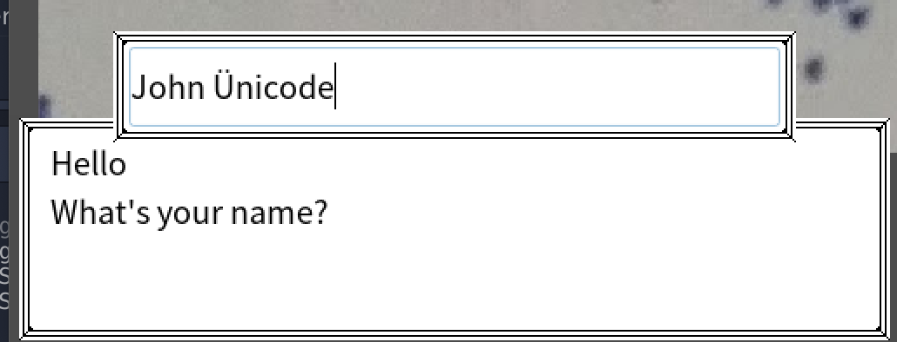

# Menu and dialog GUI for Godot

This project contains custom node types to easily implement a dialogue system with input and choices in __Godot 3.2__.

It's designed to work with mouse, keyboard and multitouch, and in HTML5 deployments

Features:

* Rich text support (formatting, colors, effects, etc.) using BBCode
* Display test immediately or writing it at a given speed, mix speeds
* Place breaks and associate signals to them
* Supports keyboard, mouse and multitouch screen
* __Blocks__ the input while dilogues is open
* Decent unicode support (it includes Noto Sans font)




## How to use

You can see the included demo for a complete practical usage example, but here's a textual documentation

### Step 0 - install the plugin

This repository also works as a Godot project that you can use to try the demo.
To use the plugin only in your game you need only the `addons/blocking_dialog_box` folder. Copy it inside your `addons` folder then enable the plugin in `Project -> project settings -> addons`

### Step 1 - insert the nodes in your project

Activating the plugin will add 3 new node types:

* BlockingDialogBox
* BlockingInputBox
* BlockingListSelection

You need to insert these nodes in this order in your main scene.

Notice that they are independent and you can import only what you need, but you should keep the relative order for them to overlap correctly.

### Step 2 - use the nodes as needed

To use the dialogue nodes you need to retrieve a reference and call their functions.

For example to display text:

```GDScript
# this assumes your main scene is called Main
var bdb: BlockingDialogBox = get_node("/root/Main/BlockingDialogBox")
bdb.append_text("Hello world! (slow)\n", 90)
bdb.append_text("Immediate, and supports [shake]effects[/shake]\n", 0)
```

the dialog box will automatically open, intercept the input to scroll and close itself when done.

To detect breaks do this:

```GDScript
func your_function():
  bdb.connect("break_ended", self, "rotate_me")
  bdb.append_text("wait for input and rotate[break clockwise]\n", 10)
  bdb.append_text("wait for input and rotate[break clockwise]\n", 10)
	bdb.append_text("wait for input and rotate back[break counterclockwise]\n", 10)

func rotate_me(direction: String):
	if direction == "clockwise":
		$AnimationPlayer.play("rotate")
	if direction == "counterclockwise":
		$AnimationPlayer.play_backwards("rotate")
		bdb.disconnect("break_ended", self, "rotate_me")
```

the `[break X]` tag will wait for the player input and then produce `break_reached` and `break_ended` signals containing the `X` parameter string.

Notice that the signal is disconnected later to avoid reacting to signals from other nodes using the dialogue box.

The input function is similar:

```GDScript
var bib: BlockingInputBox = get_node("/root/Main/BlockingInputBox")
bib.ask_input()
bib.connect("text_entered", self, "when_name_inserted")
```

same to select an element from a list:

```GDScript
var bls: BlockingListSelection = get_node("/root/Main/BlockingListSelection")
bls.ask_value(['green', 'blue', 'arrakis'])
bls.connect("choice", self, "when_item_selected")
```

## Input blocking

These three elements are designed to prevent inputs, so that for example when you choose an option in a list the UI actions don't move the character in background.

In general input is blocked if and only if the elements are displayed, and all the elements define a logic to close themselves and stop grabbing the input.

### With the keyboard
Using the keyboard the `ENTER` key goes forward in a dialogue and stops breaks.
The input box decodes the character and allows to cancel the latest one using `backspace`.
If IME is active (you can activate it globally using `OS.set_ime_active(true)`) the input element supports it.
When you are on HTML5 and mobile (mobile detection is based on agent string, couldn't find a nicer way), `window.prompt` is used instead to overcome the lack of a keyboard.

Element selection can be done with arrow keys, you can scroll faster using page up/down and select with `enter`.

### With the mouse

Left clicking advances in dialogue, scrolling the wheel moves the se3lection in the element list and clicking an element selects it.
Text input still requires a keyboard.

### Multitouch
Works like a mouse, except that you can swipe vertically in the element list to scroll and click on an element directly or clicking outside the box will select the currently selected element.

## License and contributing
This project is MIT licensed, you can use it in your own games and edit it as you please.
Contributions and feedback are welcome!
